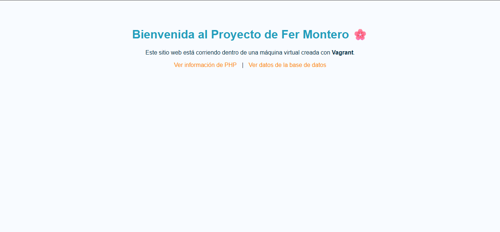
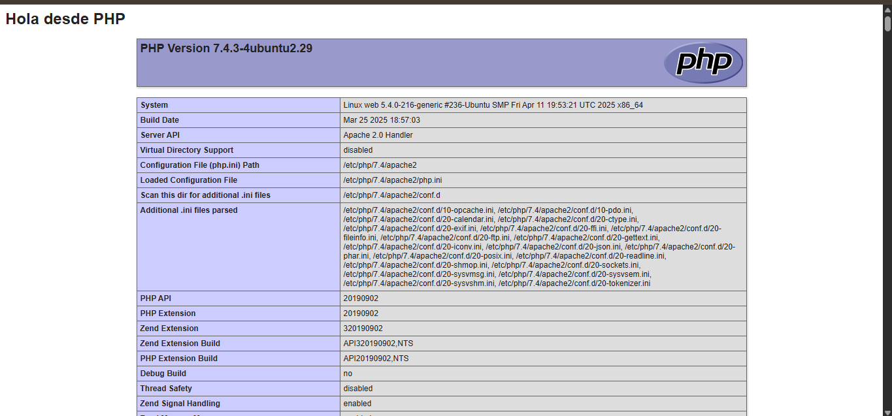

 Taller de Provisionamiento

Fergie Montero
Asignatura: Sistemas Operativos

Este proyecto implementa un entorno virtualizado con Vagrant, que crea dos máquinas virtuales conectadas entre sí que son:

  web: Servidor Apache + PHP
  db: Servidor PostgreSQL

 Requisitos previos

 Se debía tener instalado previamente:

  * Vagrant
  * VirtualBox
  * Git

Pasos:

1. Clonar el repositorio:

   bash
   git clone https://github.com/fer-montero/taller.provi.git
   cd taller.provi
   

2. Iniciar las máquinas virtuales:

   bash
   vagrant up
   

3. Acceder desde el navegador:

   * Sitio principal  [http://192.168.56.101](http://192.168.56.101)
   * Info PHP  [http://192.168.56.101/info.php](http://192.168.56.101/info.php)
   * Base de datos  [http://192.168.56.101/db.php](http://192.168.56.101/db.php)

Definir las dos máquinas:

web (Ubuntu) con Apache y PHP.
db (Ubuntu) con PostgreSQL.

También configura la red privada y la sincronización de carpetas ("www" "/var/www/html").

provision-web.sh

Script que instala Apache y PHP automáticamente:

bash
sudo apt-get update -y
sudo apt-get install -y apache2 php php-pgsql
sudo systemctl restart apache2

provision-db.sh

Script que instala y configura PostgreSQL:

bash
sudo apt-get update -y
sudo apt-get install -y postgresql postgresql-contrib
sudo -u postgres psql -c "CREATE ROLE vagrant WITH LOGIN PASSWORD 'vagrantpass';"
sudo -u postgres psql -c "CREATE DATABASE prueba_db OWNER vagrant;"

www

Contiene los archivos del sitio web que se muestra en el servidor Apache:

* index.html : Página principal personalizada
* info.php : Muestra configuración de PHP
* db.php : Conecta con PostgreSQL y muestra datos de prueba

Evidencias
 Página principal (`index.html`)     
 Info PHP (`info.php`)                 
 Datos desde PostgreSQL (`db.php`)         

Este taller permitió comprender el uso de Vagrant para crear entornos virtuales reproducibles, así como el uso de **scripts de provisionamiento** para automatizar la instalación de servicios.
Se logró la integración de un servidor web con una base de datos y la personalización del sitio de práctica, cumpliendo todos los requerimientos del reto.